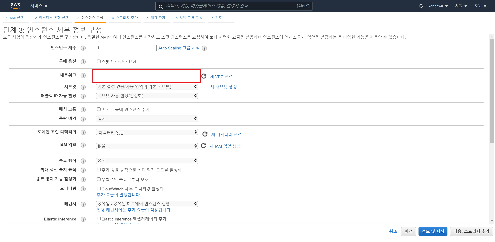
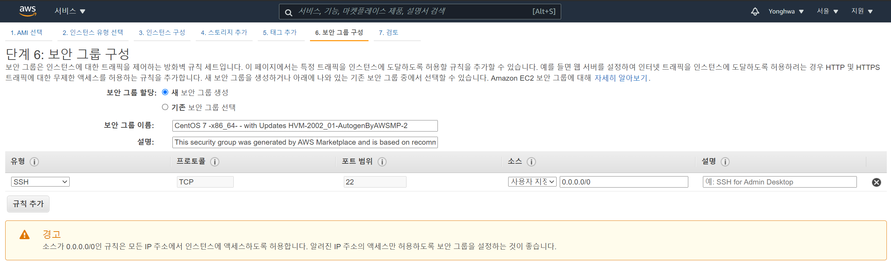

# AWS로 서버 생성

### 시작하기 전에

저는 AWS 프리티어를 이용할 것입니다.

프리티어를 이용하여 사용가능한 기능들(EC2, S3, RDS, DynamoDB 등)은 다음 사이트 참고바랍니다.

AWS프리티어: https://aws.amazon.com/free

이를 위해 프리티어 계정 회원가입, 로그인 절차까지 밟아야합니다.

로그인 및 회원가입은 https://goddaehee.tistory.com/175를 참고합시다.

 

### 서버(AWS EC2) 생성

우리가 일반적으로 사용하는 `서버`개념은 AWS에서 `EC2`로 통용됩니다.

#### AWS 관리 콘솔로 이동

로그인된 상태로 `좌측 상단 aws 로고` 를 클릭하면, `AWS 관리 콘솔` 창으로 이동합니다.

 

#### 리전(Region) 설정

리전 설정은 사용할 `서버의 물리적 위치` 를 설정하는 과정입니다.

 

#### 가상머신(EC2) 생성

클라우드 환경에서는 서버를 띄울 때, `가상머신`을 이용합니다.

`가상 머신 시작` 버튼을 눌러 서버를 생성해봅시다.

 

#### AMI(Amazon Machine Image) 선택

 서버의 초기모습은 아무것도 설정이 되어있지 않는 형태입니다. 심지어, OS(운영체제) 설치 및 환경구성 또한 되어있지 않죠. 서버 증설이 잦게 이루어지는 클라우드 환경에서 개발자가 일일이 `OS 설치 및 각종 소프트웨어 구성` 을 하는 것은 굉장한 시간낭비입니다. 이러한 `소프트웨어 구성`들이 미리 완료된 상태를 한번에 설치한다면, 굉장히 편할 것입니다.

 `가상머신 이미지`는 위에서 말한 `소프트웨어 구성` 을 의미합니다. `AMI`는 아마존에서 제공하는 가상머신 이미지를 의미합니다. 각자 선호하는 OS로 검색 및 선택하여 서버를 구성합시다. `프리티어 사용 가능`이라고 써져있는 AMI를 선택합시다.

 

#### 인스턴스 유형 선택

각 인스턴스 유형은 각 서버의 `CPU개수 및 메모리용량` 등 서버성능을 기준으로 나뉘어져있습니다.

제가 선택한 centos7 기준으로 `t2.micro` 까지는 무료로 사용가능합니다.

사실, 간단한 서버 설정은 이정도로 마치고, `검토 및 시작` 버튼을 누른 후, `시작하기` 버튼을 누르면, `서버 인스턴스`가 생성됩니다. 아래의 단계들은 사용자 서비스에 맞게 커스터마이징하는 과정입니다.

 

#### 인스턴스 구성

인스턴스의 세부 정보를 구성하는 화면입니다.

 

#### 스토리지 추가

추가적으로, 스토리지를 사용하려면 볼륨을 추가하면 됩니다.

 

#### 보안 그룹 구성

서버의 방화벽 규칙을 설정하는 화면입니다.

기본적으로는, SSH 설정이 모든 IP주소에 대해 허용되어있으나, 이는 위험하기 때문에 직접적인 사용자 PC의 IP만 허용하도록 수정하시면 됩니다.

Putty SSH를 통해 서버 내부에 접속가능합니다.

 

#### 인스턴스 시작 검토

마지막으로, 지금까지 설정한 서버관련 설정을 확인하는 단계입니다.

검토를 마친 후, `시작하기` 버튼을 누르면, 인스턴스가 생성됩니다.

