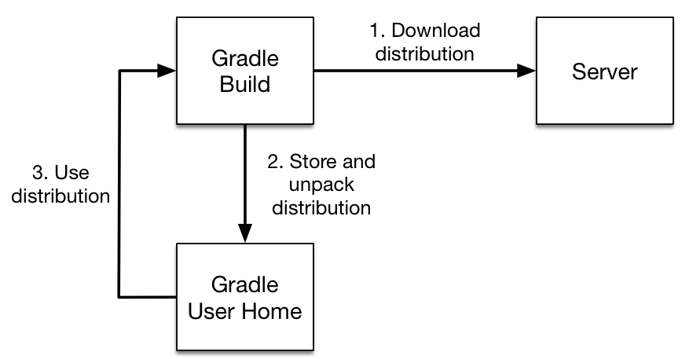

# 1장 - 스프링 개발 툴

## 1. IntelliJ로 스프링 프로젝트 생성

1. `File` - `New` - `Project` 클릭
2. `Spring Initializer` 를 이용한 프로젝트 설정
   
   - `Maven`, `Gradle` 을 선택한 후, 프로젝트 설정을 진행할 수도 있지만, `Spring` 의존체를 직접 설정해줘야하는 불편한 점이 있습니다.
   - 좀 더 편하게 `Spring` 을 이용한 개발환경을 만들기 위해 `Spring Initializer` 를 이용하고, 아래와 같이 프로젝트 정보를 설정 후, `Next`를 클릭합니다.
   - 
   
   - 필요한 `SpringBoot` 추가 의존객체를 설정합니다.
   - 
   
   - `Spring Web`, `Apache Freemarker`, `Lombok` 등 개발에 필요한 여러가지 도구들을 설정하는 창입니다.
   - `Spring Initializer` 는 https://start.spring.io/ 에서 설정한 파일을 지정한 위치에 다운받아서 IntelliJ로 import 합니다.

<br>

## 2. IntelliJ로 메이븐 프로젝트 open 및 build

1. `File` - `Open` - `가져올 Maven프로젝트 또는 모듈` 선택
2. `Maven 설치`: IntelliJ에는 기본적으로 Maven이 내장되어 있습니다. 각 버전 별로 다른 Maven이 내장되어 있습니다. 
   - 설치된 Maven 버전확인방법: `File` - `Settings` - 검색창에 `Maven` 입력
   - 
3. `Maven Build`: `우측 Maven 탭`  클릭 - `프로젝트 또는 모듈` 우클릭 - `Run Maven Build` 클릭
   - 

4. `Maven Build 결과확인` : 아래 `Run` 창에서 Build의 결과 확인가능합니다. 
   - 아래의 오류메세지가 출력된다면, `Java 설치 및 환경변수 설정`, `Maven 설치 및 환경변수 설정` 을 확인해야 됩니다.
   - `No valid Maven Installation found. Either set the home directory in the configuration dialog or set the M2_HOME environment variable on your system.`
5. `애플리케이션 실행` : Maven 빌드의 결과물로 프로젝트 - `target 디렉토리` 에 `실행가능한 jar` 파일이 생성됩니다.
   - `target 디렉토리` - `실행가능한 jar` 우클릭 - `Run 'jar파일명'` 클릭
   - 

<br>

## 3. IntelliJ로 그래들 프로젝트 open 및 build

1. `File` - `Open` - `가져올 Gradle프로젝트 또는 모듈` 선택
2. `Gradle 설치` : Gradle은 2가지 방법으로 설치될 수 있습니다. 
   1. 수동으로 Gradle 설치하는 방법
      - https://gradle.org/install/#manually 를 참고하면, 수동설치 및 환경설정하는 방법이 친절하게 나와있습니다.
   2. Gradle Wrapper 를 이용한 설치방법 - 권장되는 방법
      - import한 Gradle 프로젝트가 Gradle Wrapper를 사용하는 경우, `./gradlew build` 명령어를 실행하면, `gradle-wrapper.properties` 에 설정된 `distributionUrl` 을 통해 gradle을 설치합니다.
      - 
      - `gradle wrapper로 설치된 gradle`은 프로젝트의 `.gradle` 디렉토리 에 저장되며, 이 프로젝트에서 빌드할 때는 해당 gradle 버전을 사용합니다.
      - 설치된 Gradle 확인방법: `File` - `Settings` - 검색창에 `Gradle` 입력 - `Gradle user home` 확인
      - 
3. `Gradle Build`: 우측 `Gradle 탭` 클릭 - `Tasks` - `build` - `build` 더블클릭
   - 
   - 기존 빌드된 파일들을(`build` 디렉토리) 삭제: 우측 `Gradle 탭` 클릭 - `Tasks` - `build` - `clean` 더블클릭

4. `Gradle Build 결과확인` : 아래 `Run` 창에서 Build의 결과 확인가능합니다. 
5. `애플리케이션 실행` : Gradle 빌드의 결과물로 프로젝트 - `build/libs` 에 `실행가능한 jar` 파일이 생성됩니다.
   - `build/libs` - `실행가능한 jar` 우클릭 - `Run 'jar파일명'` 클릭

<br>

## 4. Gradle 프로젝트 구조 및 각 파일 설명

```
Project
└─ gradle
   └─ wrapper
      └─ gradle-wrapper.properties
      └─ gradle-wrapper.jar
└─ build.gradle
└─ gradlew
└─ gradlew.bat
└─ settings.gradle
```

`build.gradle`

- 빌드에 필요한 플러그인, 레포지토리, 의존성, 태스크 등을 명시하는 설정 파일

`gradlew, gradlew.bat`

- Gradle Wrapper로 빌드할 때, 실행되는 각각 리눅스용 실행스크립트, 윈도우용 실행배치스크립트 (기능은 동일함)

`gradle/wrapper/gradle-wrapper.jar`

- Gradle 배포파일을 다운로드를 실행하는 jar 파일

`gradle/wrapper/gradle-wrapper.properties`

- gradle wrapper 설정파일

`gradle/wrapper`  디렉토리를 포함한 위의 파일들은 `gitignore` 처리하면 안됩니다.

`settings.gradle`

- 프로젝트의 구성정보를 기록하는 파일입니다.
- 하위 프로젝트들이 어떤 관계로 구성되어있는지를 기술합니다.
- `멀티모듈 프로젝트`를 구성할 때, 사용되는 설정 파일입니다.

<br>

## 5. Gradle Wrapper

- gradle wrapper 흐름도

  

  출처: https://docs.gradle.org/current/userguide/gradle_wrapper.html

- 기능: `gradle-wrapper.properties` 파일에 프로젝트 빌드에 필요한 gradle 버전을 명시 및 다운로드할 수 있게하여 특정 환경에 종속되지 않고 항상 프로젝트를 빌드할 수 있게 도와줍니다. 
- 장점: `프로젝트 빌드에 필요한 gradle 버전`과 `개발환경/CI환경에서의 gradle버전`을 매번 일일이 맞추지 않아도 됩니다.

<br>

## 6. Gradle 멀티모듈 프로젝트 생성

- IntelliJ에서는 `프로젝트` 우클릭 - `New` - `Module` 을 통해 하위 gradle 모듈을 추가해줍니다.

- 프로젝트 구조

  ```
  ├── subProject
  │   ...
  │   └── build.gradle
  └── settings.gradle
  ```

- rootProject 의 `settings.gradle` 파일: 아래와 같이 `include` 명령어를 이용하여 하위 모듈을 추가될 것입니다.

  ```groovy
  rootProject.name = 'basic-multiproject'
  include 'subProject'
  ```

- rootProject의 `build.gradle` 파일: 아래와 같이 의존성에 shared 프로젝트를 추가함으로써, 함께 빌드가 되도록 합니다.

  ```groovy
  dependencies {
      projectcompile project(":shared")
      implementation project(":shared")
  }
  ```

<br>

## 7. Maven 멀티모듈 프로젝트 생성

IntelliJ에서는 `프로젝트` 우클릭 - `New` - `Module` 을 통해 하위 maven 모듈을 추가해줍니다.

상위 프로젝트 `pom.xml` 파일: 아래와 같이 하위 모듈이 추가될 것입니다.

```xml
<modules>
	<module>web</module>
	<module>admin</module>
	<module>shared</module>
</modules>
```

하위 프로젝트 `pom.xml` 파일: 아래와 같이 parent 모듈을 설정해줍니다.

```
<parent>
	<artifactId>devlog</artifactId>
	<groupId>com.madcoder</groupId>
	<version>1.0-SNAPSHOT</version>
</parent>
```

<br>

## 8. IntelliJ - Github 연동

### IntelliJ 에서 GitHub연동방법

- `VCS` 메뉴 > `Enable Version Control Integration`

  

- `Select a version control system to associate with the project root` : `Git` 선택

  

- 이제 상단의 `VCS` 메뉴가 `Git` 으로 변경됩니다.

- Commit & Push : `Git` > `Commit` 메뉴클릭

  좌측 `Commit 탭` > 커밋메세지 작성 > `Commit` 또는 `Commit and Push` 클릭

  

- 주의사항: 파일을 `Staging` 하는 기능(`Add`로 사용)은 있지만, `Unstaging` 하는 기능은 제공하지 않는 것으로 보입니다. (`Rollback` 으로 하는 것인줄 알았으나, `Unstaging` 개념이 아니라 아예 수정사항을 날려버리는 것이었습니다.)

<br>

### Github 프로젝트 별 사용자 다르게 설정하는 법

- Git 전역설정 목록확인

  하단 `Terminal` 창 클릭 - `git config --list` 입력

  

  위의 목록은 `Git에 등록되어있는 전역 설정`입니다.

- Git Commit 시 함께 기록되는 내용

  `user.name` :  이름

  `user.email` : 이메일

  위의 두 항목은 Git의 설정이므로 실제 Github 계정과 상관 없이 개인이 설정하는 것입니다.

- Git Commit 시, 기록될 이름과 이메일을 프로젝트 별로 다르게 설정하는 명령어

  ```bash
  $ git config --local user.name "이름"
  $ git config --local user.email "이메일"
  ```

  git 프로젝트 폴더에서 위의 명령어를 실행하면, 해당 프로젝트에서 Git Commit 시, 기록되는 이름과 이메일을 전역설정 값과 다르게 할 수 있습니다.

<br>

## 참고자료

https://docs.gradle.org/current/userguide/gradle_wrapper.html