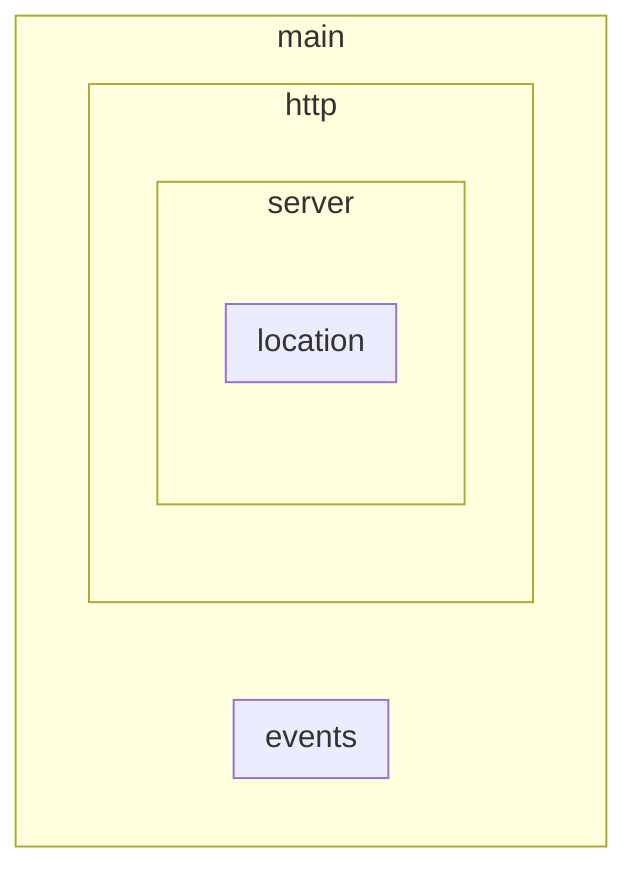

# Nginx Beginner’s Guide

https://nginx.org/en/docs/beginners_guide.html

<br>

## 구성 관련 명령어

#### nginx -s `명령어`

- `start` : 시작
- `stop` : 빠른 종료 (현재까지 인입된 모든 request를 처리하지 않고 종료)
- `quit` : 우아한 종료 (현재까지 인입된 모든 request를 처리 후에 종료)
- `reload` : 구성 파일 변경 적용
- `reopen` : 로그 파일 다시 열기

<br>

#### UNIX 명령어

- `kill -s QUIT [nginx master process의 프로세스 ID]` : nginx 종료
- `ps -ax | grep nginx` : 실행 중인 nginx 프로세스 확인 (master process와 worker process 모두 보입니다.)

<br>

## 구성 파일 구조

#### 지시문 (directive)

- 단순 지시문 (simple directive) : `지시문 파라미터;`구조로 되어있습니다.

- 블록 지시문 (block directive) : `지시문 파라미터 { }` 구조로 되어있습니다. 블록 지시문의 괄호 내부에는 또다른 지시문을 명시할 수 있습니다.

<br>

#### 컨텍스트 (context)



컨텍스트란 `블록 지시문`의 괄호에 의해 형성된 내부 영역을 말합니다.

기본적으로 어떤 블록 지시문에도 속하지 않은 영역은 `main 컨텍스트`에 속하게 됩니다.

<br>

## 정적파일 제공

#### 요구사항

request URI에 따라 다른 local directory에서 파일을 제공합니다.

- request URI가 `/` 일 때: `/data/www` 디렉토리 내부의 파일에서 탐색
- request URI가 `/images` 일 때: `/data/images` 디렉토리 내부의 파일에서 탐색

<br>

#### 요구사항에 맞는 구성 파일

```nginx
http {
    server {
        location / {
            root /data/www;
        }
        
        location /images/ {
            root /data;
        }
    }
}
```

위와 같이 구성하면, 아래와 같은 흐름에 의해 요청을 처리합니다.

<br>

#### 구성 파일이 요청을 처리하는 흐름

1. request 를 어떤 `server 블록` 에서 처리할지 결정합니다.
   - 이 가이드에서는 방법이 자세히 안나오지만, `server names 지시문`의 파라미터(요청 도메인)와 `listen 지시문`의 파라미터 (포트번호)를 이용하여 일치하는 `server 블록`으로 request를 전송합니다.
2. request 를 어떤 `location 블록` 에서 처리할지 결정합니다.
   - server 블록 내의 모든 `location 지시문과 파라미터`에 대해 `request 헤더에 명시된 URI`와 매칭되는 것이 존재하는지 검증합니다.
   - 만약, `request 헤더에 명시된 URI`와 매칭되는 `location 지시문과 파라미터`이 여러 개 있다면 아래와 같은 방법으로 정합니다.
     - `location ~ [regular expression] 형태로 지정한 지시문` 중에서 매칭되는 location 중 가장 먼저 등장한 location 블록으로 결정
     - 위에 해당하는 것이 없다면
       `location /[prefix] 형태로 지정한 지시문`  중에서 prefix의 길이가 가장 긴 location 블록으로 결정
3. request 에 대한 response로 어떤 `local file`로 제공할지 결정합니다.
   - `location 지시문` 안에서 제공할 파일의 경로를 명시하는 지시문에는 `root` 와`alias` 2가지가 있습니다. (`alias` 지시문은 다른 가이드에서 알아봅니다.)
   - `root 지시문` 의 파라미터는 제공할 파일의 경로의 prefix로 명시합니다. 
   - 즉, `제공할 파일 경로` = `root 지시문 파리미터`의 뒤에 `location 지시문과 매칭된 request URI`를 붙인 형태입니다.

<br>

#### 구성 파일이 요청을 처리하는 예시1) - http://localhost/some/example.html

1. request 를 어떤 `server 블록` 에서 처리할지 결정합니다.
   - `listen 지시문`이 명시되지 않은 `server 블록`은 기본적으로 `80` 포트로 들어오는 request를 처리합니다.
2. request 를 어떤 `location 블록` 에서 처리할지 결정합니다.
   - server 블록 내의 모든 `location 지시문과 파라미터`에 대해 `request 헤더에 명시된 URI`와 매칭되는 것이 존재하는지 검증합니다.
   - 2개의 `prefix가 지정된 location 블록` 중 파라미터가 `prefix가 /`인 `location 블록`만 매칭이 됩니다.
3. request 에 대한 response로 어떤 `local file`로 제공할지 결정합니다.
   - `root 지시문` 의 파라미터인 `/data/www`는 제공할 파일의 경로의 prefix로 명시합니다. 
   - `location 지시문과 매칭된 request URI`는 `/some/example.html` 입니다.
   - 즉, `제공할 파일 경로` = `/data/www` 와 `/some/example.html` 를 붙인 `/data/www/some/example.html` 가 됩니다.

<br>

#### 구성 파일이 요청을 처리하는 예시2) - http://localhost/images/example.png

1. request 를 어떤 `server 블록` 에서 처리할지 결정합니다.
   - `listen 지시문`이 명시되지 않은 `server 블록`은 기본적으로 `80` 포트로 들어오는 request를 처리합니다.
2. request 를 어떤 `location 블록` 에서 처리할지 결정합니다.
   - server 블록 내의 모든 `location 지시문과 파라미터`에 대해 `request 헤더에 명시된 URI`와 매칭되는 것이 존재하는지 검증합니다.
   - 2개의 `prefix가 지정된 location 블록` 모두 매칭이 되지만, prefix 길이 규칙에 따라 `prefix 가 /images`인 `location 블록`으로 request가 전송됩니다.
3. request 에 대한 response로 어떤 `local file`로 제공할지 결정합니다.
   - `root 지시문` 의 파라미터인 `/data`는 제공할 파일의 경로의 prefix로 명시합니다. 
   - `location 지시문과 매칭된 request URI`는 `/images/example.png` 입니다.
   - 즉, `제공할 파일 경로` = `/data` 와 `/images/example.png` 를 붙인 `/data/images/example.png`  가 됩니다.

<br>

## 프록시 서버 설정

#### 요구사항

이미지 파일 요청은 `local directory` 에서 파일을 제공하고, 그 외의 모든 요청은 프록시 서버로 보내도록 합니다.

- request URI가 `.gif` 또는 `.jpg` 또는 `.png` 로 끝날 때 (이미지 파일 요청일 때): `/data/images` 디렉토리 내부의 파일에서 탐색
- 그 외의 요청 일 때: 프록시 서버로 전송

<br>

#### 요구사항에 맞는 구성 파일

```nginx
http {
    # 이미지 파일 외의 요청을 처리하는 프록시 서버 설정
    server {
        listen 8080;
        root /data/up1;
        # server 블록의 root 지시문은 매칭된 location 블록의 root 지시문이 없을 때에만 사용됩니다.

        location / {
        }
    }
    
    # 이미지 파일 요청을 처리하는 서버 설정
    # 이미지 파일 외의 요청은 프록시 서버로 전송
    server {
        location / {
            proxy_pass http://localhost:8080;
        }
        
        location ~ \.(gif|jpg|png)$ {
            root /data/images;
        }
    }
}
```

위와 같이 구성하면, 아래와 같은 흐름에 의해 요청을 처리합니다.

<br>

#### 구성 파일이 요청을 처리하는 예시1) - http://localhost/some/example.html

1. request 를 어떤 `server 블록` 에서 처리할지 결정합니다.
   - `listen 지시문`이 명시되지 않은 `server 블록`은 기본적으로 `80` 포트로 들어오는 request를 처리합니다.
   - 즉, 아래에 위치한 `server 블록`으로 request를 전송합니다.
2. request 를 어떤 `location 블록` 에서 처리할지 결정합니다.
   - server 블록 내의 모든 `location 지시문과 파라미터`에 대해 `request 헤더에 명시된 URI`와 매칭되는 것이 존재하는지 검증합니다.
   - 2개의 `location 블록` 중 파라미터가 `prefix 가 /`인 `location 블록`만 매칭이 됩니다.
3. request 에 대한 response로 어떤 `local file`로 제공할지 결정합니다.
   - `proxy_pass` 지시문은 request를 대신 처리할 프록시 서버의 이름과 프로토콜을 명시합니다.
   - 여기서는 `http://localhost:8080` 이므로 해당 프록시 서버로 request를 전송합니다.
4. proxy된 request (`http://localhost:8080/some/example.html`)를 어떤 `server 블록` 에서 처리할지 결정합니다.
   - `listen 지시문`의 파라미터인 `8080` 은 request의 포트번호인와 일치하므로 해당 `server 블록`이  request를 전송합니다.
   - 즉, 위에 위치한 `server 블록`으로 request를 전송합니다.
5. proxy된 request (`http://localhost:8080/some/example.html`)를 어떤 `location 블록` 에서 처리할지 결정합니다.
   - server 블록 내의 모든 `location 지시문과 파라미터`에 대해 `request 헤더에 명시된 URI`와 매칭되는 것이 존재하는지 검증합니다.
   - `prefix 가 /`인 `location 블록`만 매칭이 됩니다.
6. proxy된 request (`http://localhost:8080/some/example.html`)에 대한 response로 어떤 `local file`로 제공할지 결정합니다.
   - `location 블록`에 `root 지시문`이 없으므로 `server 블록에 위치한 root 지시문`을 사용합니다. 파라미터인 `/data/up1`는 제공할 파일의 경로의 prefix로 명시합니다. 
   - `location 지시문과 매칭된 request URI`는 `/some/example.html` 입니다.
   - 즉, `제공할 파일 경로` = `/data/up1` 와 `/some/example.html` 를 붙인 `/data/up1/some/example.html` 가 됩니다.

<br>

#### 구성 파일이 요청을 처리하는 예시2) - http://localhost/example.png

1. request 를 어떤 `server 블록` 에서 처리할지 결정합니다.
   - `listen 지시문`이 명시되지 않은 `server 블록`은 기본적으로 `80` 포트로 들어오는 request를 처리합니다.
   - 즉, 아래에 위치한 `server 블록`으로 request를 전송합니다.
2. request 를 어떤 `location 블록` 에서 처리할지 결정합니다.
   - server 블록 내의 모든 `location 지시문과 파라미터`에 대해 `request 헤더에 명시된 URI`와 매칭되는 것이 존재하는지 검증합니다.
   - 2개의 `location 블록` 모두 매칭이 되지만, regular expression 우선 규칙에 따라 `regular expression 이 ~ \.(gif|jpg|png)$`인 `location 블록`으로 request를 전송합니다.
3. request 에 대한 response로 어떤 `local file`로 제공할지 결정합니다.
   - `root 지시문` 의 파라미터인 `/data/images`는 제공할 파일의 경로의 prefix로 명시합니다. 
   - `location 지시문과 매칭된 request URI`는 `/example.png` 입니다.
   - 즉, `제공할 파일 경로` = `/data/images` 와 `/example.png` 를 붙인 `/data/images/example.png`  가 됩니다.

<br>