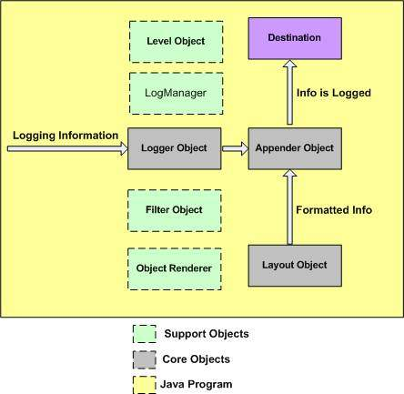

# Log4j

log4j는 logging을 하기 위한 구현체입니다.

현재는 log4j 에 대한 지원이 종료되어 log4j2 사용하는 것을 권장하지만, 레거시 코드에는 여전히 남아있으므로 알아봅니다.

<br>

### 로그 레벨

우선, 로깅을 하기 전에 로그 레벨에 대해 알아봅니다.

로그레벨은 아래와 같이 나뉘어져있습니다.

| 우선순위 | 이름  | 의미                                                         |
| -------- | ----- | ------------------------------------------------------------ |
| 1        | TRACE | 단어 그대로 코드의 흐름을 추적하기 위한 로그 레벨입니다.     |
| 2        | DEBUG | 단어 그대로 코드를 디버깅하기 위한 로그 레벨입니다.          |
| 3        | INFO  | 정보성 메세지를 남기기 위한 로그 레벨입니다.                 |
| 4        | WARN  | 잠재적으로 위험을 부를 수 있는 상황에 대한 정보를 남기기 위한 로그 레벨입니다. |
| 5        | ERROR | 오류 상황이 발생할 때, 오류의 정보를 남기기 위한 로그 레벨입니다.<br />ERROR 는 발생 이후에도 어플리케이션이 실행될 수 있습니다. |
| 6        | FATAL | 치명적인 오류 상황이 발생할 때, 오류의 정보를 남기기 위한 로그 레벨입니다.<br />FATAL 은 발생 이후에도 어플리케이션이 중지됩니다. |
|          | ALL   | 가장 낮은 로그 레벨을 지정하여 모든 로깅을 허용하기 위한 로그 레벨입니다. |
|          | OFF   | 가장 높은 로그 레벨을 지정하여 모든 로깅을 허용하지 않기 위한 로그 레벨입니다. |

<br>

### log4j의 구성요소

아래는 log4j의 구성요소로 log4j 설정파일(`.xml파일` 또는 `.properties 파일`)에서는 아래 4가지를 설정합니다.

1. logger: logger는 로그를 appender로 전달하는 주체입니다. logger에게 로깅 요청이 들어오면, logger의 레벨과 로깅 요청의 레벨을 비교합니다. **요청된 로그의 레벨이 logger에 설정된 레벨보다 같거나 높을 때에만 로그 요청을 받아들여 appender로 전달**합니다. 또한, 어떤 appender로 로그를 전송할지 결정합니다.
2. appender: appender는 로그가 저장될 저장소(Console, File 또는 NELO와 같은 외부저장소)에 대한 설정입니다.
3. layout: appender로 로그를 저장할 때, 어떤 형식(LogFormat) 으로 로깅할 지에 대한 설정을 의미합니다.
4. root: root는 logger의 최상위 개념으로 어떤 logger로도 구별되지 않은 logger로 들어온 로깅 요청(Tomcat 서버, DB 커넥션풀, third party 라이브러리 등에서 출력하는 로그)에 대해 level과 appender를 설정할 수 있습니다.

<br>



### logger 속성의 특징

#### 1. [level 상속](https://logging.apache.org/log4j/1.2/manual.html) - Level Inheritance 참고

logger는 상위 계층의 level을 상속합니다. 현재 logger에서 지정된 level이 없다면, 가장 가까운 부모부터 root까지 순차적으로 탐색하며, 설정된 level이 존재하다면, 해당 level을 그대로 사용합니다.

root는 level 프로퍼티 대신, priority 프로퍼티를 사용합니다. (용어만 다르고, 동일한 의미입니다.)

예를 들면, 아래와 같습니다.

```xml
<root>
	<priority value="info"></priority>
	<appender-ref ref="file"></appender-ref>
</root>
<logger name="X">
	<level value="debug"></level>
</logger>
<logger name="X.Y.Z">
	<level value="warn"></level>
</logger>
```

<br>

| logger 이름 | 명시된 level | 실제 사용할 level |
| :---------- | :----------- | :---------------- |
| root        | INFO         | INFO              |
| X           | DEBUG        | DEBUG             |
| X.Y         | 없음         | DEBUG             |
| X.Y.Z       | WARN         | WARN              |

<br>

#### 2. [appender 추가](https://logging.apache.org/log4j/1.2/manual.html) - Appender Additivity 참고

logger는 상위 계층의 appender를 상속합니다. 현재 logger로 기록된 로그는 현재 logger에 설정되어 있는 appender 뿐만 아니라 logger의 조상에 설정되어 있는 appender에도 로그를 저장합니다. 이를 `appender additivity` 라고 부릅니다.

즉, 아래의 logger에서 위 방향으로 log가 전파되어 계층상 조상 logger에 설정된 appender에 log가 저장되는 방식입니다. 이러한 위 방향으로의 전파를 막기 위해서는 logger에 `additivity="false"` 설정을 추가합니다. 

appender additivity를 추가하지 않을 때, 발생할 수 있는 문제에 대하여 알아봅시다. 

예를 들어, 아래와 같은 설정에서는 동일한 log가 2번 쓰이는 문제가 발생할 수 있습니다.

```xml
<root>
	<priority value="info"></priority>
	<appender-ref ref="file"></appender-ref>
</root>
<logger name="com.madcoder">
	<level value="info"></level>
	<appender-ref ref="file"></appender-ref>
</logger>
```

위와 같은 설정에서 `com.madcoder` logger로 들어온 로그는 `com.madcoder`의 appender 뿐만 아니라 root 의 appender 로도 전달되어 2번의 로그가 출력됩니다. (일반적으로 Java에서의 상속을 생각하여 동일한 appender 는 오버라이딩 되어 1개의 appender로만 로깅을 출력하지 않을까라는 오해를 하지만, 실제로는 logger는 여러 개의 동일한 appender에 로그를 남기는 것을 허용하기 때문에 이는 잘못된 생각입니다.)

그래서, `com.madcoder` logger를 사용하여 info 레벨 이상의 로깅을 출력하면, 실제로 파일에는 2개의 INFO 로그가 남게됩니다.

위와 같이 동일한 로그를 동일한 파일에 2번씩 남기는 것은 리소스 낭비입니다. 위와 같이 logger로 들어온 로그가 상위 logger의 appender로 전파되는 것을 방지하기 위해서는 logger에 `additivity="false"` 설정을 추가합니다. 적용한 설정은 다음과 같습니다.

```xml
<root>
	<priority value="info"></priority>
	<appender-ref ref="file"></appender-ref>
</root>
<logger name="com.madcoder" additivity="false">
	<level value="info"></level>
	<appender-ref ref="file"></appender-ref>
</logger>
```

<br>

### logger의 의존관계

1. Java -> logger : Java Application은 log4j.xml 파일에서 설정한 logger를 가져옵니다. 

   - `private static final Logger testLogger = Logger.getLogger("TestLogger")` - logger를 log4j.xml파일에서 설정된 logger 이름으로 지정하여 가져오는 경우

     logger에서 name 값이 `TestLogger` 로 설정된 logger 를 가져옵니다.

     ```xml
     <logger name="TestLogger" additivity="false">
     	<level value="info"></level>
     	<appender-ref ref="file"></appender-ref>
     </logger>
     ```

   - `private static final Logger madcoderLogger = Logger.getLogger(this.getClass());` - logger를 클래스로 지정하여 가져오는 경우

     현재 클래스가 `com.madcoder` 하위에 위치할 경우, 아래의 logger 를 가져옵니다.

     ```xml
     <logger name="com.madcoder" additivity="false">
     	<level value="info"></level>
     	<appender-ref ref="file"></appender-ref>
     </logger>
     ```

   - 또한, 가져온 logger를 이용하여 Java 에서 logging을 남깁니다.

     ```java
     testLogger.trace("This is trace Logger");
     testLogger.debug("This is debug Logger");
     testLogger.info("This is info Logger");
     testLogger.warn("This is warn Logger");
     testLogger.error("This is error Logger");
     
     // Exception에 대한 정보를 넘길 때는 아래와 같이 사용합니다.
     String npe = null;
     try{
         System.out.println(null);
     }catch(NullPointerException ex){
         logger.error("NPE occured!", ex);
     }
     ```

2. logger -> appender: Java Application에 의해 logger가 사용되면, logger로 기록된 log들은 어디로 저장이 될까요? logger는 appender 설정을 사용하여 기록된 log를 어느 저장소로 보낼지 설정합니다. logger는 여러 개의 appender를 지정할 수 있습니다.

   log4j에서 기본적으로 제공하는 Appender의 종류는 2가지가 있습니다.

   - org.apache.log4j.ConsoleAppender: Console에 로그를 출력할 때, 사용합니다.
   - org.apache.log4j.RollingFileAppender: File에 로그를 저장할 때, 사용합니다. (이 때, RollingFile은 File이 매일 새로운 파일이 생성되며, 해당 파일에 로그를 저장하는 것을 의미합니다.)

   ConsoleAppender 설정 방법에 대해 먼저 알아보겠습니다.

   ```xml
   <appender name="console" class="org.apache.log4j.ConsoleAppender">
   	<param name="Target" value="System.out" />
   	<layout class="org.apache.log4j.PatternLayout">
   		<param name="ConversionPattern" value="%d{yyyy-MM-dd HH:mm:ss.SSS} [%t] %-5p %c - %m%n" />
   	</layout>
   </appender>
   ```

   - Target은 로그를 출력할 대상 스트림을 의미합니다.
   - layout은 로깅 형식을 의미합니다. layout 역시, logger와 appender 처럼 log4j의 일반적인 구성요소 중 하나이므로 아래에서 자세하게 설명합니다.

   <br>

   이어서 RollingFileAppender 설정 방법에 대해 먼저 알아보겠습니다. log저장파일을 rolling 하는 방법에는 크게 2가지가 있습니다.

   1. RollingFileAppender - 로그 저장 파일의 size를 기준으로 롤링하는 방식 (여기서, 롤링이란 기존에 로그를 저장하던 파일의 크기가 커지면, 이를 접어서 다른 파일로 옮겨두고, 새로운 파일에 다시 로그를 저장하는 것을 의미합니다.)

      ```xml
      <appender name="roll-by-size" class="org.apache.log4j.RollingFileAppender">
          <param name="file" value="target/log4j/roll-by-size/app.log" />
          <param name="MaxFileSize" value="5KB" />
          <param name="MaxBackupIndex" value="2" />
              <layout class="org.apache.log4j.PatternLayout">
                  <param name="ConversionPattern" value="%d{yyyy-MM-dd HH:mm:ss} %-5p %m%n" />
              </layout>
      </appender>
      ```

      - file: log를 저장할 파일의 경로를 명시합니다.
   - MaxFileSize: log를 저장하는 File의 크기가 지정한 값을 넘어서면, log 저장 파일을 roll-over합니다. (교체)
      - MaxBackupIndex: 롤링되는 백업 log 저장 File의 최대 개수를 지정합니다. 
      
      <br>

      그 결과, 다음과 같이 동작합니다.

      1. app.log 파일의 크기가 5KB 를 넘어서면, log4j가 app.log 파일의 이름을 app.log.1로 변경하여 백업해둡니다. 그리고, 빈 app.log 파일을 새로 생성하여 다시 로그를 저장합니다.
   2. 또 다시 app.log 파일의 크기가 5KB 를 넘어서면, log4j가 app.log.1 파일의 이름을 app.log.2로 변경하여 백업해둡니다. app.log 파일의 이름은 app.log.1로 변경하여 백업해둡니다. 그리고, 빈 app.log 파일을 새로 생성하여 다시 로그를 저장합니다.
      3. MaxBackupIndex가 2로 설정되어 있기 때문에 app.log.3 파일까지는 유지하지 않습니다. 즉, 특정 시점이 되면 로그가 유실됩니다.
      
      ```
      27/11/2016  10:28    138 app.log
      27/11/2016  10:28  5.281 app.log.1
      27/11/2016  10:28  5.281 app.log.2
      ```
      
      <br>

   2. RollingFileAppender - 로그 저장 파일의 날짜를 기준으로 롤링하는 방식 (여기서, 롤링이란 기존에 로그를 저장하던 파일의 크기가 커지면, 이를 접어서 다른 파일로 옮겨두고, 새로운 파일에 다시 로그를 저장하는 것을 의미합니다.)

      ```xml
      <appender name="roll-by-time"
          class="org.apache.log4j.rolling.RollingFileAppender">
          <rollingPolicy class="org.apache.log4j.rolling.TimeBasedRollingPolicy">
              <param name="FileNamePattern" value="target/log4j/roll-by-time/app.%d{HH-mm}.log.gz" />
          </rollingPolicy>
          <layout class="org.apache.log4j.PatternLayout">
              <param name="ConversionPattern" value="%d{yyyy-MM-dd HH:mm:ss} %-5p - %m%n" />
          </layout>
      </appender>
      ```
   
      - rollingPolicy: 롤링 정책을 정합니다. log4j에서 제공하는 TimeBasedRollingPolicy를 적용합니다.
   - TimeBasedRollingPolicy.FileNamePattern: log를 저장할 파일의 경로를 명시함과 동시에 log를 롤링할 시간 기준을 명시합니다. 시간 포맷은 log4j에서 제공하는 [org.apache.log4j.PatternLayout](https://logging.apache.org/log4j/1.2/apidocs/org/apache/log4j/PatternLayout.html) 에 지정된 로그 포맷 규칙을 사용합니다. 포맷에 대한 설명은 아래 layout을 설명하는 글에 작성해두었습니다.
      - layout은 로깅 형식을 의미합니다. layout 역시, logger와 appender 처럼 log4j의 일반적인 구성요소 중 하나이므로 아래에서 자세하게 설명합니다.
      
       <br>
   
      위와 같이 설정하면 다음과 같이 동작합니다.

      - `app.%d{HH-mm}.log.gz` 을 롤링 시간 기준으로 지정하였습니다. 현재 시각에 해당하는 `시-분`을 계산하여 해당 파일명의 파일에 log를 기록합니다. 만약, 현재 `시-분`이 변경되면, 새로운 파일명을 가진 log파일을 생성하고, log를 기록합니다.

   3. DailyRollingFileAppender - 로그 저장 파일의 날짜를 기준으로 롤링하는 방식 (여기서, 롤링이란 기존에 로그를 저장하던 파일의 크기가 커지면, 이를 접어서 다른 파일로 옮겨두고, 새로운 파일에 다시 로그를 저장하는 것을 의미합니다.)

      ```xml
      <appender name="RollingAppender" class="org.apache.log4j.DailyRollingFileAppender">
          <param name="File" value="app.log" />
          <param name="DatePattern" value="'.'yyyy-MM-dd" />
          <layout class="org.apache.log4j.PatternLayout">
          	<param name="ConversionPattern" value="[%p] %d %c %M - %m%n"/>
          </layout>
      </appender>
      ```
   
      - File: 로그를 저장할 파일의 경로를 명시합니다.
      - DatePattern: log를 롤링할 시간 기준을 명시합니다. `'.'yyyy-MM-dd` 에서 `'.'`은 순수하게 `.` 을 파일명 뒤에 사용하기 위한 이스케이핑 방법입니다. 이와 같이 명시하면, log를 저장하는 파일명은 `app.log.2023-01-12`가 됩니다.
      - layout은 로깅 형식을 의미합니다. layout 역시, logger와 appender 처럼 log4j의 일반적인 구성요소 중 하나이므로 아래에서 자세하게 설명합니다.

   4. AsyncAppender - 별도의 스레드를 사용하여 로그를 전송하면 전송 속도를 빠르게 증가시킬 수 있습니다.
   
      ```xml
      <appender name="console-async" class="org.apache.log4j.AsyncAppender">
          <param name="Threshold" value="WARN" />
          <param name="blocking" value="false" />
          <param name="locationInfo" value="false" />
          <param name="bufferSize" value="2048" />
          <appender-ref ref="console" />
      </appender>
      ```
   
      - Threshold: appender로 전달된 로그의 레벨을 기준으로 출력할지 말지 결정합니다. Threshold 로 설정된 로그의 레벨보다 높은 레벨의 로깅 요청만 받아들입니다.
      - blocking: 로그를 저장소에 출력하는 것을 blocking 방식으로 할지 non-blocking 방식으로 할지 설정합니다. 버퍼에 여유 공간이 없을 때, appender로 들어온 로그 요청을 버퍼에 담아두기 위해 기다릴지(blocking) 안할지 설정하는 역할입니다.
      - locationInfo: 로그 요청이 발생한 location 정보를 전송할지에 대해 설정합니다. 아래 layout 정리 자료에서 살펴보겠지만, location 정보를 출력하는 것은 성능에 좋지 않기 때문에 false로 설정합니다.
      - bufferSize: 로그를 한꺼번에 전송하기 전에 버퍼에 담아둘 로그 요청의 개수를 설정합니다.
      - appender-ref: 로그의 원천이 되는 appender를 설정합니다. 예를 들어, console 을 설정한다면, console appender로 들어오는 로그 요청을 읽어들여 비동기 스레드로 console appender의 목적지로 전송을 합니다.
   
3. appender -> layout : appender로 전달된 log들은 어떤 형식으로 출력(저장)이 될까요? appender는 layout 설정을 사용하여 기록된 log를 어떤 형식으로 출력할지 설정합니다.

   일반적으로 log4j에서 제공하는 [org.apache.log4j.PatternLayout](https://logging.apache.org/log4j/1.2/apidocs/org/apache/log4j/PatternLayout.html) 에 지정된 로그 포맷 규칙을 사용합니다. 로그 포맷 규칙을 살펴보면 아래와 같습니다.

   - `%d{yyyy-MM-dd HH:mm:ss.SSS}` : 로그 이벤트가 발생한 시각을 출력합니다.

   - `%t` : 로그 이벤트가 생성된 스레드의 이름을 출력합니다.

   - `%p` : 로그 이벤트의 레벨을 출력합니다. (ex: ERROR, WARN 등) `%-5p`는 5글자로 글자가 차지하는 공간을 일정하게 맞춰주기 위한 설정입니다.

   - `%c` : logger의 이름(카테고리라도 부르기 때문에 c라는 약어를 사용합니다.)을 출력합니다. 이 때, `%c{n}, 여기서 n은 숫자`로 설정하면, 카테고리에서 가장 오른쪽의 n개의 카테고리 이름만 출력됩니다. 또한, logger를 package로 지정하여 가져오는 방식을 취한다면, logger의 이름은 FQCN(클래스 풀네임)이 적용됩니다. 예를 들어, `private static final Logger madcoderLogger = Logger.getLogger(this.getClass());` 명령어로 logger를 가져온다면, logger 이름(카테고리)은 `com.madcoder.test.TestClass`가 됩니다. 그래서, `%c`를 설정하면, `com.madcoder.test.TestClass`가 출력되고, `%c{1}`으로 설정하면, `TestClass` 만 출력이 됩니다.

   - `%C` : logger가 호출된 클래스의 풀네임(fully qualified class name)을 출력합니다. 이 때, `%C{n}, 여기서 n은 숫자`로 설정하면, 클래스의 풀네임에서 가장 오른쪽의 n개의 이름만 출력됩니다. 예를 들어, logger 가 호출된 클래스의 풀네임이 `com.madcoder.test.TestClass`라고 가정할 때, `%C{1}` 으로 설정하면, `TestClass` 만 출력이 됩니다. **다만, 클래스 정보를 가져오는 것은 매우 느리기 때문에 실행속도가 문제가 되는 상황에서는 사용하지 않는 것이 좋습니다.**

   - `%m` : 로그 이벤트로 전달된 메세지를 출력합니다.

   - `%n` : 플랫폼에 맞는 줄 구분자를 출력합니다. (다음 줄에 로그를 이어서 출력해야되기 때문에 사용합니다.)

   - `%l` : 로그 이벤트가 생성된 클래스의 위치(location) 정보를 출력합니다. **클래스 풀네임과 호출된 줄의 번호를 가져오는 것은 매우 느리기 때문에 반드시 실행속도가 문제가 되는 상황에서는 사용하지 않는 것이 좋습니다.**

   - `%L` : 로그 요청이 발생한 줄의 번호를 출력합니다. **호출된 줄의 번호를 가져오는 것은 매우 느리기 때문에 반드시 실행속도가 문제가 되는 상황에서는 사용하지 않는 것이 좋습니다**.

   - `%M` : 로그 요청이 발생한 메소드명을 출력합니다. **호출된 메소드 명 정보를 가져오는 것은 매우 느리기 때문에 반드시 실행속도가 문제가 되는 상황에서는 사용하지 않는 것이 좋습니다.**

   - `%X` : MDC에 맵핑된 정보를 출력합니다. 예를 들어, `%X{clientNumber}` 는 MDC.get("clientNumber") 의 값을 가져와 출력합니다.

     [MDC](https://logging.apache.org/log4j/1.2/apidocs/org/apache/log4j/MDC.html) 는 mapped diagnostic context 의 약어로 직역하면 **맵핑된 진단 문맥**을 말합니다. MDC는 현재 로그에 대한 추가적인 정보를 기록할 때, 추가로 전달하는 **Mapping 정보를 말합니다.** 예를 들어 `MDC.put("clientNumber", 1001)` 과 같은 코드를 주면 현재 로그 상황에서 요청을 한 고객의 번호라는 정보를 clientNumber 라는 키에 값을 추가하는 것입니다.

<br>

### log4j의 성능

1. logging을 하지 않을 때

   log 요청은 2가지 비용이 발생합니다.

   1. 메소드 호출
   2. logger의 level과 현재 log 요청의 level 비교(정수 비교)

   **위 요청은 5 ~ 50 ns(nano seconcs)의 비용이 듭니다.**

   여기서, 메소드 호출에는 사실, `parameter 생성`이라는 숨겨진 비용이 추가로 발생합니다.

   예를 들어 아래의 log요청이 발생했다고 합시다.

   ```java
   logger.debug("Entry number: " + i + " is " + String.valueOf(entry[i]));
   ```

   이 때, logger의 level이 DEBUG보다 높게 설정되어있다면, 실제 log 요청이 발생해도 logger에서 이 요청을 거절할 것입니다. 하지만, `i` 와 `entry[i]` 라는 paramter를 String으로 변환하여 생성하는 비용이 발생합니다.

   **즉, log 요청 메소드 발생 시, 실제 logging이 발생하지 않지만 parameter 를 생성하는 불필요한 비용이 발생하는 것입니다.** 만약, 이러한 parameter 생성 비용이 상당히 커진다면, 문제가 될 것 입니다. 이러한 문제를 방지하기 위해서는 아래와 같이 log 요청을 생성하는 것이 좋습니다.

   ```java
   if(logger.isDebugEnabled()) {
   	logger.debug("Entry number: " + i + " is " + String.valueOf(entry[i]));
   }
   ```

   **logger.isDebugEnabled() 메소드가 추가로 발생하지만 이는 실제 log가 호출 비용의 1% 정도의 비용만 소요되기 때문에 크게 영향을 미치지 않습니다.**

2. logging을 해야할지 안해도될지 결정할 때

   logger의 level을 판단할 때, 상위 계층을 따라 올라가면서 판단을 해야됩니다.

   현재 logger의 level보다 낮은 level의 log가 전달되면 바로 logging을 안해도 된다는 것이 판단이 될 것입니다.

   반대로, 현재 logger의 level보다 높은 level의 log가 전달되면 상위 계층의 logger의 level을 판단해야하는 비용이 추가로 발생합니다. 

   이 때, **전자의 경우보다 후자의 경우는 상위 계층을 찾는 비용으로 인해 3배는 더 오래 걸립니다.**

3. logging을 할 때

   실제 로깅이 발생하면, **100 ~ 300ms의 시간**이 걸립니다.

<br>

### log4j 설정방법

#### 의존성 추가

pom.xml 파일에 아래와 같이 추가합니다.

```xml
<dependency>
    <groupId>log4j</groupId>
    <artifactId>log4j</artifactId>
    <version>1.2.17</version>
</dependency>
```

<br>

#### xml을 이용한 설정

src/main/resources 디렉토리 하위에 log4j.xml 파일을 생성하고, 아래와 같이 설정합니다.

log4j-{phase}.xml 로 설정하면, phase 별로 다르게 설정가능합니다.

```
<?xml version="1.0" encoding="UTF-8"?>
<!DOCTYPE log4j:configuration PUBLIC "-//log4j/log4j Configuration//EN" "log4j.dtd">

<log4j:configuration xmlns:log4j="http://jakarta.apache.org/log4j/">
    <appender name="console" class="org.apache.log4j.ConsoleAppender">
        <param name="Target" value="System.out" />
        <layout class="org.apache.log4j.PatternLayout">
            <param name="ConversionPattern" value="%d{yyyy-MM-dd HH:mm:ss.SSS} [%t] %-5p %c - %m%n" />
        </layout>
    </appender>

    <appender name="file" class="org.apache.log4j.DailyRollingFileAppender">
        <param name="File" value="application.log" />
        <param name="DatePattern" value="'.'yyyy-MM-dd" />
        <layout class="org.apache.log4j.PatternLayout">
            <param name="ConversionPattern" value="%d{yyyy-MM-dd HH:mm:ss.SSS} [%t] %-5p %c - %m%n" />
        </layout>
    </appender>

    <appender name="console-async" class="org.apache.log4j.AsyncAppender">
        <param name="Threshold" value="WARN" />
        <param name="blocking" value="false" />
        <param name="locationInfo" value="false" />
        <param name="bufferSize" value="2048" />
        <appender-ref ref="console" />
    </appender>

    <root>
        <priority value="DEBUG"/>
        <appender-ref ref="console-async" />
        <appender-ref ref="file" />
    </root>

</log4j:configuration>
```

<br>

#### java 파일에서 logger를 호출하여 사용

```
package com.madcoder;

import org.apache.log4j.Logger;

public class Main {

    public static void main(String[] args) {
        Logger logger = Logger.getLogger(Main.class);
        logger.trace("This is TRACE log");
        logger.debug("This is DEBUG log");
        logger.info("This is INFO log");
        logger.warn("This is WARN log");
        logger.error("This is ERROR log");
    }
}
```

<br>

#### 결과 - Console 창

AsyncAppender의 Threshold 설정으로 인해 WARN 레벨 이상만 출력됩니다.

```
2023-01-12 18:04:58.125 [main] WARN  com.madcoder.Main - This is WARN log
2023-01-12 18:04:58.132 [main] ERROR com.madcoder.Main - This is ERROR log
```

<br>

#### 결과 - application.log 파일

root logger의 priority 설정으로 인해 DEBUG 레벨 이상만 출력됩니다.

```
2023-01-12 18:04:58.124 [main] DEBUG com.madcoder.Main - This is DEBUG log
2023-01-12 18:04:58.125 [main] INFO  com.madcoder.Main - This is INFO log
2023-01-12 18:04:58.125 [main] WARN  com.madcoder.Main - This is WARN log
2023-01-12 18:04:58.132 [main] ERROR com.madcoder.Main - This is ERROR log
```

<br>

### 참고자료

https://logging.apache.org/log4j/1.2/manual.html

https://logging.apache.org/log4j/1.2/apidocs/org/apache/log4j/PatternLayout.html

https://logging.apache.org/log4j/1.2/apidocs/org/apache/log4j/MDC.html

https://logging.apache.org/log4j/1.2/apidocs/org/apache/log4j/AsyncAppender.html

https://www.tutorialspoint.com/log4j/log4j_architecture.htm

https://www.digitalocean.com/community/tutorials/log4j-properties-file-example

https://www.baeldung.com/java-logging-rolling-file-appenders

https://www.codejava.net/coding/configure-log4j-for-creating-daily-rolling-log-files
