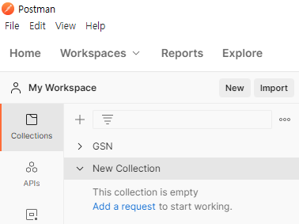
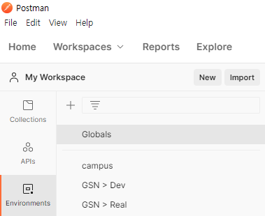
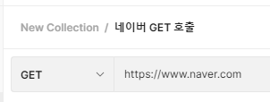
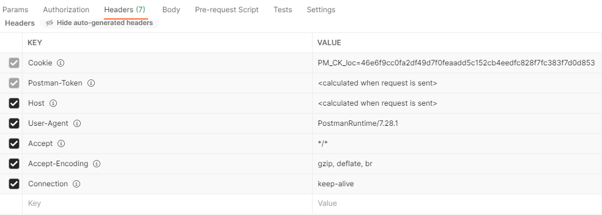
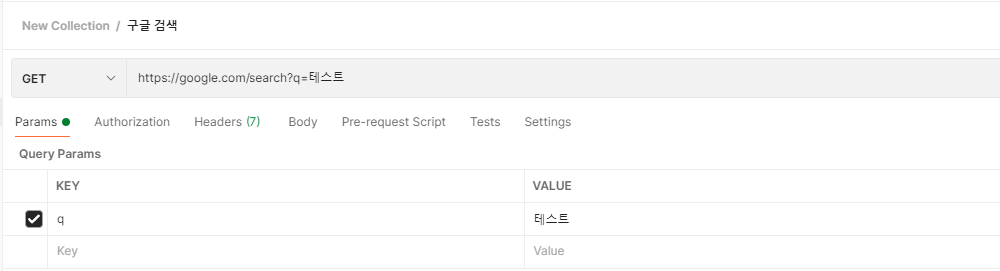
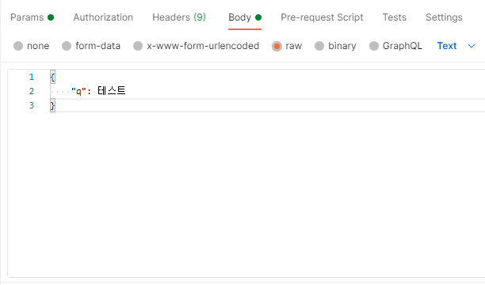

## POSTMAN 사용법

### 용어정리

POSTMAN 에서 사용하는 용어에 대해서 가볍게 정리해봅니다.

###### Collections

여러개의 API를 묶는 그룹의 개념입니다. `+` 버튼으로 새로운 API그룹을 생성할 수 있습니다.

###### Environments

환경변수를 의미합니다. 실무에서는 alpha, beta, real 환경에 따라 사용하는 accessToken 및 Client 값이 달라지는 것이 보통이기 때문에, 각 환경의 변수 값을 저장하여 값을 직접 수정하는 것이 아닌 `변수`를 수정하는 방식을 사용합니다.

어떤 환경에서든 공통적으로 사용할 수 있는 Global 환경변수와 지역환경변수로 나뉘어집니다.

### 사용법

1. Method: `GET`, `POST` 등 확인하고 싶은 Method를 선택합니다.

2. URL: 확인하고 싶은 Server Domain + Path 조합을 입력합니다.

    Server Domain 의 경우, 좌측 상단 `Environments`를 통해 설정해놓는다.

    

3. Headers

    `User-Agent`, `Accept`, `Accept-Encoding`, `Connection` 등 다양한 Header Option을 설정할 수 있고, 체크박스를 통해 어떤 Header를 사용할지 선택할 수 있습니다.

    

4. Parameter

    Method가 `GET` 방식으로 설정되어있을 때, `query string`에 들어갈 parameter key와 value 값을 설정하면, 자동으로 URL의 뒤에 `query string`을 추가해줍니다.

    

5. Body

    Method가 `POST` 방식으로 설정되어있을 때, JSON으로 Body에 객체를 넘겨주려면 체크박스에서는 `raw`를 선택하고, 셀렉트박스에서는 `JSON`을 선택합니다.

    Body에는 JSON 형식에 맞춰서 `key: value,` 형태로 입력합니다.

    `key`는 String 형태로 반드시 `""`를 붙여준다. `value`는 정수, 문자열, 배열 형태가 들어갈 수 있습니다.

    