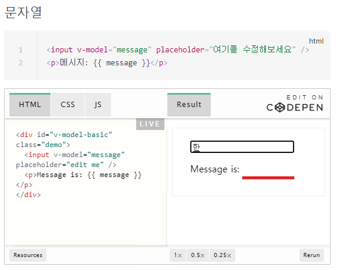
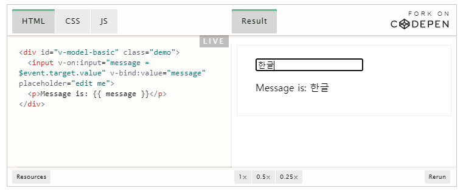

# Vue에서 한글 입력값을 바로 반영하는 방법

### 일반적인 방법

일반적으로 Vue에서는 문자열을 폼 입력값을 바인딩 할 때, `v-model` 을 이용합니다.

그러나, [가이드 문서](https://v3.vuejs-korea.org/guide/forms.html#%E1%84%86%E1%85%AE%E1%86%AB%E1%84%8C%E1%85%A1%E1%84%8B%E1%85%A7%E1%86%AF)에서 테스트해보면, 알 수 있듯이 **영어**, **숫자** 입력 값은 바로 바인딩되지만

**한글**입력은 바로 데이터에 바인딩이 되지 않습니다. (유니코드 문자 입력 시, 발생하는 현상으로 보이는데, 유니코드 문자열인 일본어와 중국어 입력에 대해서도 비슷한 현상가 발생합니다.)

#### v-model 사용 코드

```vue
<template>
    <div id="v-model-basic" class="demo">
      <input v-model="message" placeholder="edit me" />
      <p>Message is: {{ message }}</p>
    </div>
</template>

<script>
export default {
  data() {
    return {
      message: ''
    }
  }
}
</script>
```

<br>

#### v-model 이용 시, 한글입력이 바로 바인딩 되지 않는 현상



<br>

### 해결방법

#### v-on:input 사용 코드 (input 이벤트와 value 속성을 이용한 데이터 바인딩)

```vue
<template>
    <div id="v-model-basic" class="demo">
    <input v-on:input="message = $event.target.value" v-bind:value="message" placeholder="edit me">
      <p>Message is: {{ message }}</p>
    </div>
</template>

<script>
export default {
  data() {
    return {
      message: ''
    }
  }
}
</script>
```

<br>

#### v-on:input 이용 시, 한글입력이 바로 바인딩 됨



<br>

### 참고자료

https://v3.vuejs-korea.org/guide/forms.html#%E1%84%80%E1%85%B5%E1%84%87%E1%85%A9%E1%86%AB-%E1%84%89%E1%85%A1%E1%84%8B%E1%85%AD%E1%86%BC%E1%84%87%E1%85%A5%E1%86%B8