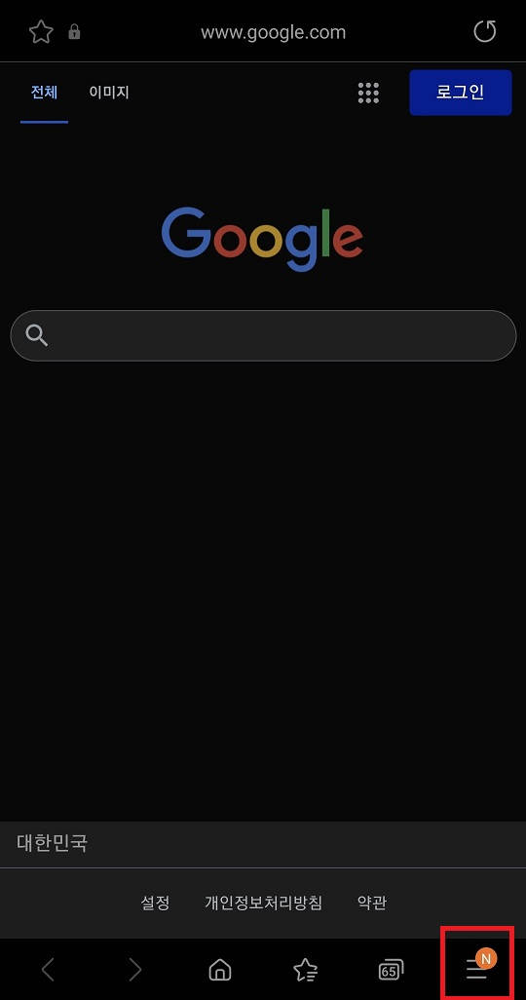

# Android 캐시 삭제

### 삼성인터넷 앱 캐시 삭제

#### 최신 Android 기기

1. 삼성인터넷 우측 하단 메뉴

   

2. 설정

   

3. 개인데이터

   

4. 검색 데이터 삭제

   

5. 전체 선택 후 삭제

   

 

#### 구형 Android 기기

http://samsungsimulator.com/output/service/simulator/9096d877-9e6c-4455-8c07-e592788f0e7a/

 

### 앱에 저장된 URL 캐시 삭제

1. 캐시를 삭제할 앱을 **2초** 누른 상태에서, **i** 버튼 클릭

   

2. 저장공간

   

3. 캐시삭제

   이 때, `캐시삭제` 가 아닌 `데이터삭제` 버튼을 누르면, 단순한 캐시정보 뿐만 아니라, 기존에 열어놓았던 페이지 정보들을 모두 날릴 수 있으니 주의해야합니다.

